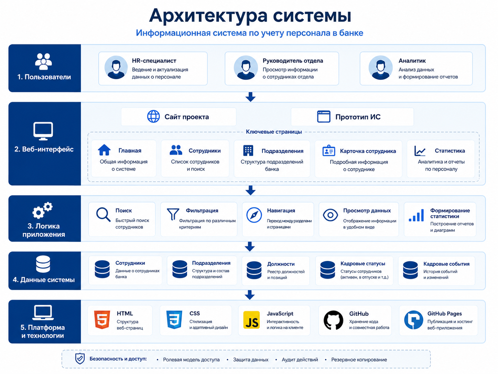
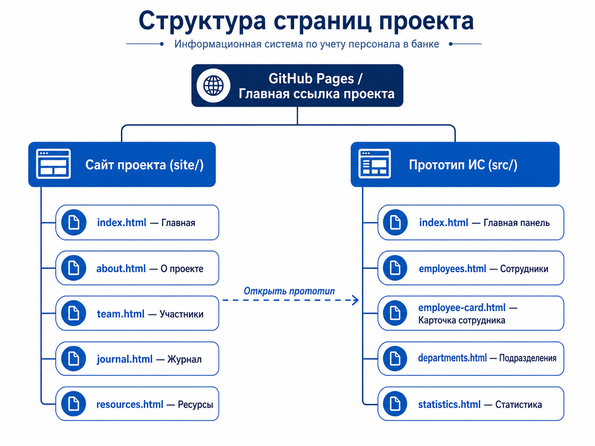
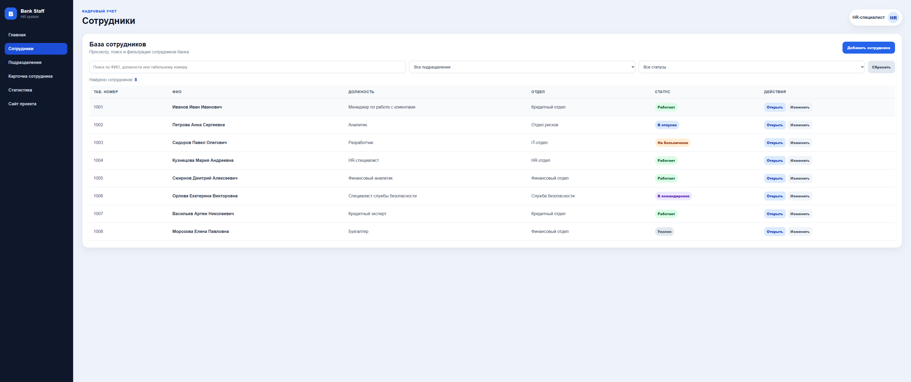

# Листинг кода проекта

## Общая информация

В данном разделе представлены основные фрагменты кода, использованные при разработке сайта проекта и прототипа информационной системы по учету персонала в банке.

Листинги демонстрируют структуру HTML-страниц, оформление визуальных материалов, работу JavaScript-функций поиска и фильтрации, а также настройку перехода с главной страницы GitHub Pages на сайт проекта.

---

## Листинг 1 — Корневой файл перехода на сайт проекта

Файл: `index.html`

```html
<!DOCTYPE html>
<html lang="ru">
<head>
  <meta charset="UTF-8">
  <meta http-equiv="refresh" content="0; url=site/index.html">
  <title>Информационная система учета персонала в банке</title>
</head>
<body>
  <p>
    Переход на сайт проекта:
    <a href="site/index.html">открыть сайт</a>
  </p>
</body>
</html>
```

Данный файл используется для перенаправления пользователя с корневой страницы GitHub Pages на главную страницу сайта проекта.

---

## Листинг 2 — Блок визуальных материалов на странице «О проекте»

Файл: `site/about.html`

```html
<section class="content-section light">
  <div class="container">
    <h2 class="section-title">Визуальные материалы проекта</h2>

    <div class="gallery-grid">
      <a class="gallery-card" href="../images/pages-structure.png" target="_blank">
        
        <span>Структура страниц проекта</span>
      </a>

      <a class="gallery-card" href="../images/system-architecture.png" target="_blank">
        
        <span>Архитектура системы</span>
      </a>

      <a class="gallery-card" href="../images/employees-page.png" target="_blank">
        
        <span>Страница сотрудников</span>
      </a>
    </div>
  </div>
</section>
```

Данный фрагмент отвечает за отображение графических материалов проекта на странице «О проекте». Каждое изображение оформлено как кликабельная карточка и открывается в новой вкладке.

---

## Листинг 3 — Стилизация галереи изображений

Файл: `site/style.css`

```css
.gallery-grid {
  display: grid;
  grid-template-columns: repeat(2, minmax(0, 1fr));
  gap: 24px;
  align-items: stretch;
}

.gallery-card {
  display: flex;
  flex-direction: column;
  text-decoration: none;
  color: #0f172a;
  background: #ffffff;
  border-radius: 18px;
  overflow: hidden;
  border: 1px solid #e5e7eb;
  box-shadow: 0 14px 34px rgba(15, 23, 42, 0.12);
  transition: 0.2s;
}

.gallery-card:hover {
  transform: translateY(-4px);
  box-shadow: 0 18px 44px rgba(15, 23, 42, 0.16);
}

.gallery-card img {
  width: 100%;
  aspect-ratio: 16 / 9;
  object-fit: contain;
  background: #f8fafc;
  padding: 12px;
  display: block;
}

.gallery-card span {
  display: block;
  padding: 14px 16px;
  font-weight: 800;
  text-align: center;
  border-top: 1px solid #e5e7eb;
}

@media (max-width: 850px) {
  .gallery-grid {
    grid-template-columns: 1fr;
  }
}
```

Данный CSS-код задает внешний вид галереи: сетку карточек, тени, скругления, адаптивность и эффект наведения.

---

## Листинг 4 — Массив данных сотрудников

Файл: `src/app.js`

```js
const employees = [
  {
    id: "1001",
    name: "Иванов Иван Иванович",
    position: "Менеджер по работе с клиентами",
    department: "Кредитный отдел",
    status: "Работает"
  },
  {
    id: "1002",
    name: "Петрова Анна Сергеевна",
    position: "Аналитик",
    department: "Отдел рисков",
    status: "В отпуске"
  },
  {
    id: "1003",
    name: "Сидоров Павел Олегович",
    position: "Разработчик",
    department: "IT-отдел",
    status: "На больничном"
  }
];
```

Массив `employees` используется как демонстрационная база данных сотрудников. Каждый объект содержит табельный номер, ФИО, должность, подразделение и кадровый статус.

---

## Листинг 5 — Функция определения CSS-класса статуса

Файл: `src/app.js`

```js
function getStatusClass(status) {
  if (status === "Работает") {
    return "green";
  }

  if (status === "В отпуске") {
    return "blue";
  }

  if (status === "На больничном") {
    return "orange";
  }

  if (status === "В командировке") {
    return "purple";
  }

  if (status === "Уволен") {
    return "red";
  }

  return "gray";
}
```

Функция используется для назначения визуального класса кадровому статусу сотрудника. Благодаря этому разные статусы отображаются разными цветами.

---

## Листинг 6 — Вывод сотрудников в таблицу

Файл: `src/app.js`

```js
function renderEmployees(list) {
  const tableBody = document.getElementById("employeeTableBody");
  const employeeCount = document.getElementById("employeeCount");

  tableBody.innerHTML = "";

  list.forEach((employee) => {
    const row = document.createElement("tr");

    row.innerHTML = `
      <td>${employee.id}</td>
      <td>${employee.name}</td>
      <td>${employee.position}</td>
      <td>${employee.department}</td>
      <td>
        <span class="status ${getStatusClass(employee.status)}">
          ${employee.status}
        </span>
      </td>
      <td>
        <a class="table-link" href="employee-card.html">Открыть</a>
      </td>
    `;

    tableBody.appendChild(row);
  });

  employeeCount.textContent = list.length;
}
```

Функция `renderEmployees()` отвечает за динамическое отображение списка сотрудников в таблице на странице `employees.html`.

---

## Листинг 7 — Поиск и фильтрация сотрудников

Файл: `src/app.js`

```js
function filterEmployees() {
  const searchValue = document
    .getElementById("employeeSearch")
    .value
    .toLowerCase();

  const departmentValue = document.getElementById("departmentFilter").value;
  const statusValue = document.getElementById("statusFilter").value;

  const filteredEmployees = employees.filter((employee) => {
    const matchesSearch =
      employee.id.toLowerCase().includes(searchValue) ||
      employee.name.toLowerCase().includes(searchValue) ||
      employee.position.toLowerCase().includes(searchValue);

    const matchesDepartment =
      departmentValue === "all" || employee.department === departmentValue;

    const matchesStatus =
      statusValue === "all" || employee.status === statusValue;

    return matchesSearch && matchesDepartment && matchesStatus;
  });

  renderEmployees(filteredEmployees);
}
```

Данная функция реализует поиск сотрудников по табельному номеру, ФИО и должности. Также она выполняет фильтрацию по подразделению и кадровому статусу.

---

## Листинг 8 — Подключение обработчиков событий

Файл: `src/app.js`

```js
const employeeTableBody = document.getElementById("employeeTableBody");

if (employeeTableBody) {
  document
    .getElementById("employeeSearch")
    .addEventListener("input", filterEmployees);

  document
    .getElementById("departmentFilter")
    .addEventListener("change", filterEmployees);

  document
    .getElementById("statusFilter")
    .addEventListener("change", filterEmployees);

  document
    .getElementById("resetFilters")
    .addEventListener("click", () => {
      document.getElementById("employeeSearch").value = "";
      document.getElementById("departmentFilter").value = "all";
      document.getElementById("statusFilter").value = "all";

      renderEmployees(employees);
    });

  renderEmployees(employees);
}
```

Этот фрагмент подключает обработчики событий для строки поиска, фильтров и кнопки сброса. После загрузки страницы выполняется первичный вывод всех сотрудников.

---

## Вывод

Представленные фрагменты кода демонстрируют основные элементы реализации проекта:

* структуру HTML-страниц;
* оформление визуальных материалов;
* адаптивную галерею изображений;
* хранение демонстрационных данных сотрудников;
* вывод сотрудников в таблицу;
* поиск и фильтрацию данных;
* обработку пользовательских действий.

Данный листинг подтверждает реализацию интерфейсной и визуальной части проекта.
