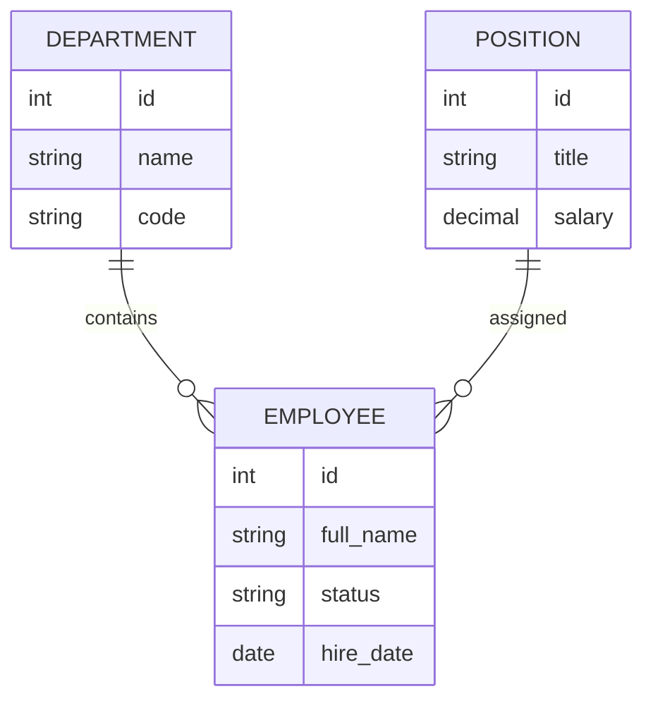

# ER-диаграмма

```mermaid
erDiagram

DEPARTMENT ||--o{ EMPLOYEE : contains
POSITION ||--o{ EMPLOYEE : assigned

DEPARTMENT {
 int id
 string name
 string code
}

POSITION {
 int id
 string title
 decimal salary
}

EMPLOYEE {
 int id
 string full_name
 string status
 date hire_date
}
```